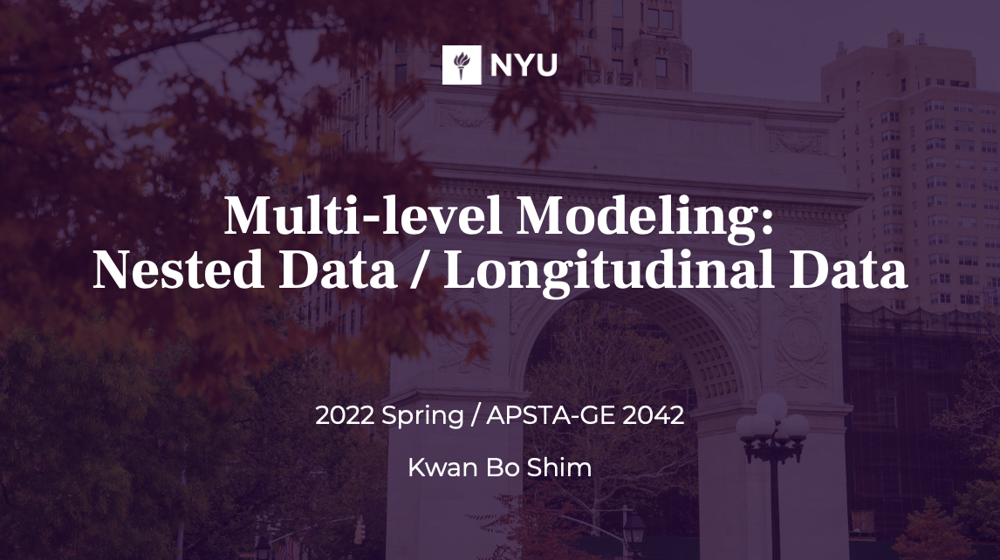

# Multi-level Modeling course (2022 Spring)
course sub-material for Multi-level Modeling

  - Week 1 - [ Handout 1 ](https://brightspace.nyu.edu/content/enforced/186015-SP22_APSTA-GE_2042_7W2_001/MLMSp22handout1.pdf)  | [ Jamboard ](https://jamboard.google.com/d/1gV2_v10hDhzzeKTVrXwSJ8rLKIuWNQDnieDE4W5hQTI/viewer) | [ Lab 0 ](https://apsta.shinyapps.io/MLM-Sim/)

  - Week 2 - [ Handout 2 ](https://brightspace.nyu.edu/content/enforced/186015-SP22_APSTA-GE_2042_7W2_001/MLMSp22handout2.pdf)  | [ Jamboard ](https://jamboard.google.com/d/1NVRXMLLXT-yPgIAkvQbYzpj16NZL_MaWEZoMt9mITrQ/viewer) | [ Lab 1 ](https://apsta.shinyapps.io/MLM-MLE/) | [ Slides ](https://brightspace.nyu.edu/content/enforced/186015-SP22_APSTA-GE_2042_7W2_001/w2_office_hours.pdf)

  - Week 3 - [ Handout 3 ](https://brightspace.nyu.edu/content/enforced/186015-SP22_APSTA-GE_2042_7W2_001/MLMSp22handout3.pdf)  | [ Jamboard ](https://jamboard.google.com/d/1NVRXMLLXT-yPgIAkvQbYzpj16NZL_MaWEZoMt9mITrQ/viewer) | [ Slides ](https://brightspace.nyu.edu/content/enforced/186015-SP22_APSTA-GE_2042_7W2_001/w3_office_hours.pdf)
  
  - Week 4 - [ Handout 4 ](https://brightspace.nyu.edu/content/enforced/186015-SP22_APSTA-GE_2042_7W2_001/MLMSp22handout4.pdf) | [ Jamboard ](https://jamboard.google.com/d/1NVRXMLLXT-yPgIAkvQbYzpj16NZL_MaWEZoMt9mITrQ/viewer) 
  
  - Week 5 - [ Handout 5 ](https://brightspace.nyu.edu/content/enforced/186015-SP22_APSTA-GE_2042_7W2_001/MLMSp22handout5.pdf) | [ Jamboard ](https://jamboard.google.com/d/1NVRXMLLXT-yPgIAkvQbYzpj16NZL_MaWEZoMt9mITrQ/viewer) | [ Lab 2 ](https://apsta.shinyapps.io/MLM-Centering/)
  
  - Week 6 - [ Handout 5 ](https://brightspace.nyu.edu/content/enforced/186015-SP22_APSTA-GE_2042_7W2_001/MLMSp22handout6.pdf) | [ Jamboard ](https://jamboard.google.com/d/1NVRXMLLXT-yPgIAkvQbYzpj16NZL_MaWEZoMt9mITrQ/viewer)

