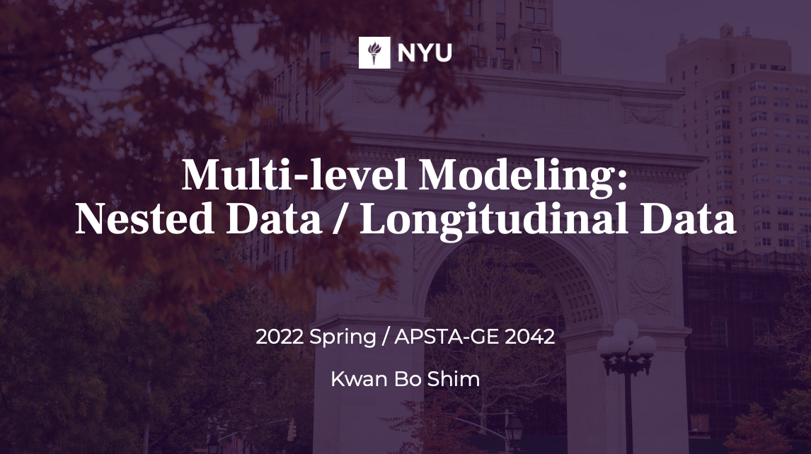

# Multi-level Modeling course (2022 Spring)
course sub-material for Multi-level Modeling

  - Week 1 - [ codes & slides ](https://github.com/JosephKBS/21fall_statcomp/tree/main/w1) | [ R Shiny ](https://apsta.shinyapps.io/MLM_W1/) | [ Jamboard ](https://jamboard.google.com/d/1gV2_v10hDhzzeKTVrXwSJ8rLKIuWNQDnieDE4W5hQTI/viewer)

  - Week 2 - [ codes & slides ](https://github.com/JosephKBS/21fall_statcomp/tree/main/w2) | [ R Shiny ](https://apsta.shinyapps.io/MLM_W2/) | [ Jamboard ](https://jamboard.google.com/d/1NVRXMLLXT-yPgIAkvQbYzpj16NZL_MaWEZoMt9mITrQ/viewer)

  - Week 3 - [ codes & slides ](https://github.com/JosephKBS/21fall_statcomp/tree/main/w3) | [ R Shiny app ](https://apsta.shinyapps.io/StatCompWeek3/)

  - Week 4 - [ codes & slides ](https://github.com/JosephKBS/21fall_statcomp/tree/main/w4) | [ R Shiny app ](https://apsta.shinyapps.io/StatCompWeek4/)

  - Week 5 - [ codes & slides ](https://github.com/JosephKBS/21fall_statcomp/tree/main/w5) | [ R Shiny app ](https://apsta.shinyapps.io/StatCompWeek5/)

  - Week 6 - [ codes & slides ](https://github.com/JosephKBS/21fall_statcomp/tree/main/w6) | [ R Shiny app ](https://apsta.shinyapps.io/StatCompWeek6/)

  - Week 7 - [ codes & slides ](https://github.com/JosephKBS/21fall_statcomp/tree/main/w7) | [ R Shiny app ](https://apsta.shinyapps.io/StatCompWeek7/)
